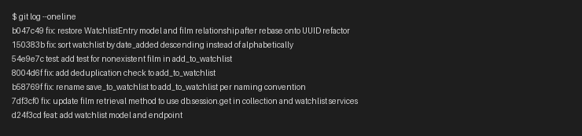

# PR Response Doc — CineLog Watchlist Feature

## Commit History Screenshot
`git log --oneline main..feature/watchlist` (7 commits, all conventional, no merges):

## AI Usage
<!-- Filled in at the end -->

## Comment 1 — Rename
**What I did:** Renamed `save_to_watchlist()` to `add_to_watchlist()` in `services/watchlist_service.py` to match the project's `verb_to_noun` naming convention (`add_to_collection()`, `remove_from_collection()`, `get_collection()`). Updated the docstring's first line to match, updated the import and call site in `routes/watchlist/watchlist.py`, and left `WatchlistEntry`/behavior unchanged.
**How I verified:** Ran `grep -rn "save_to_watchlist\|add_to_watchlist" --include="*.py" .` before and after the change to confirm there was exactly one call site (`routes/watchlist/watchlist.py`) and that no reference to the old name remained afterward. Also ran `pytest tests/ -v` to confirm the existing suite still passes.

## Comment 2 — Deduplication
**What I did:** Added a duplicate check to `add_to_watchlist()` that mirrors `add_to_collection()`: after confirming the film exists, query for an existing `WatchlistEntry` with the same `user_id`/`film_id` and raise a new `AlreadyInWatchlistError` (defined in `watchlist_service.py`, parallel to `AlreadyInCollectionError`) if one is found, before creating the entry. I also updated `routes/watchlist/watchlist.py` to catch `AlreadyInWatchlistError` and return 409, and to actually catch `FilmNotFoundError` and return 404 — it was already imported there but never used, so a nonexistent film previously would have raised an unhandled 500.
**How I verified:** Ran the full test suite (`pytest tests/ -v`) to confirm no regressions, and manually traced both the collection and watchlist add paths side by side to confirm the duplicate-check logic and exception shapes match.

## Comment 3 — Missing test
**What I did:** Created `tests/test_watchlist.py` with the same `app`, `sample_user`, and `sample_film` fixtures as `tests/test_collection.py`, and added `test_add_to_watchlist_nonexistent_film_raises`, the direct equivalent of `test_add_to_collection_nonexistent_film_raises` — it asserts that calling `add_to_watchlist()` with a film ID that doesn't exist raises `FilmNotFoundError`.
**How I verified:** Ran `pytest tests/test_watchlist.py -v` to confirm the new test passes, then `pytest tests/ -v` to confirm the full suite (5 tests) passes with no regressions.

## Comment 4 — Default visibility
**My position:** Keep `public=True` as the default for new `WatchlistEntry` rows.

**Reasoning:** CineLog's whole premise is social film tracking — collections and ratings are already visible with no privacy toggle at all, so the app's implicit contract with users is "your activity is public unless you say otherwise." Watchlists are also the part of the product with the most social value: seeing what a friend wants to watch is what makes "let's watch something together" or a recommendation feed possible. If watchlist entries defaulted to private, that entire use case would be silently dead for every entry a user forgets to flip to public, and CineLog doesn't yet have a mechanism (notification, onboarding prompt, etc.) to make users aware they need to opt in. Matching the existing "public by default" behavior of collections also keeps the two features consistent, so a user doesn't have to learn two different privacy models within the same app.

**Tradeoff acknowledged:** The real cost of `public=True` is that a user's watchlist can reveal what they intend to watch — which is sometimes more personal than what they've already watched (e.g., it can telegraph interest in a sensitive topic before the user has decided whether they're comfortable sharing that). A first-time user who doesn't read documentation could be surprised that their watchlist is visible by default. If CineLog's user base grows beyond people who already expect a social, Letterboxd-like experience, that surprise-exposure risk gets larger, and a privacy-by-default (`public=False`) model would be safer for the least-informed user at the cost of muting the social feature for anyone who doesn't actively opt in.

## Comment 5 — Sort order
**My position:** Switched `get_watchlist()` from alphabetical (`Film.title.asc()`) to `date_added` descending (newest first), matching @dev-lead's suggestion.

**Reasoning:** I agree with the date-added ordering, mainly for a reason beyond "the maintainer asked for it": `get_collection()` already sorts by `date_added` descending, and a user moving between their collection view and their watchlist view within the same session shouldn't have to remember that one is newest-first and the other is alphabetical. A watchlist also behaves more like a queue than a catalog — when someone opens it, the question they're usually answering is "what did I just add / what's next," not "let me browse alphabetically," so newest-first actually serves the common case better than A–Z.

**Engagement with reviewer's point:** Alphabetical was my original implementation, but I don't think it holds up against the consistency argument above — nothing in the current API (no search or filter params) makes alphabetical browsing specifically valuable, so there's no real use case being sacrificed by dropping it as the default. If a future need for alphabetical browsing does show up (e.g., a very long watchlist), I'd rather solve that with an explicit `?sort=` query param than by making the two features default to different orders.

## Comment 6 — Rebase
**What conflicted:** `main` had merged a refactor (`refactor: migrate film IDs from integer to UUID`) that migrated `Film.id` and `CollectionEntry.film_id` from `db.Integer` to `db.String(36)`, and — since `WatchlistEntry` didn't exist on `main` at that point — deleted the `WatchlistEntry` class from `models.py` entirely on that branch. Git's three-way merge during `git rebase origin/main` auto-resolved `models.py` textually (no conflict markers), but the result silently dropped `WatchlistEntry` from the file, and `WatchlistEntry.film_id` was still typed as `db.Integer`, pointing at a `Film.id` that was now a UUID string. There was also a real text conflict in `.gitignore` (both branches added one independently).
**How I resolved it:** For `.gitignore`, I merged both versions (kept `.pytest_cache/` from `main`'s version alongside the entries from my own commit). For `models.py`, I re-added the `WatchlistEntry` class after `CollectionEntry`, with `film_id` typed as `db.String(36)` to match the UUID refactor, and added a `Film.watchlist_entries` relationship (`db.relationship("WatchlistEntry", backref="film", lazy=True)`) — this was missing even before the rebase and caused `get_watchlist()` to throw `AttributeError: 'WatchlistEntry' object has no attribute 'film'` the first time I exercised the endpoint manually. I also updated stale docstrings/comments in `watchlist_service.py` and `routes/watchlist/watchlist.py` that described `film_id` as an integer.
**How I verified no conflict remains:** Ran `git status` to confirm a clean rebase with no unresolved paths, `git log --oneline main..feature/watchlist` to confirm no merge commits, `pytest tests/ -v` (all 5 tests pass), and manually started the app (`python app.py`) to exercise `POST /watchlist/<user_id>/add` and `GET /watchlist/<user_id>` end-to-end with a real UUID film ID — including the duplicate (409) and nonexistent-film (404) cases — to confirm the UUID types and the film relationship work correctly together.

## AI Usage (continued)
I used AI assistance throughout this project for: reading `models.py`, `services/collection_service.py`, and `tests/test_collection.py` to understand the naming convention and deduplication pattern before touching any code (Milestone 1); confirming via `grep` that call sites were fully updated after the Comment 1 rename; and as a final check on `git log --oneline` output against the conventional commits spec before taking the screenshot. For Comments 4 and 5, I drafted my position first from CineLog's actual code and README, then asked AI to argue the counter-position (a reviewer favoring `public=False` by default, and a reviewer favoring alphabetical order) to check whether my reasoning held up. In Comment 4, this surfaced the "first-time user surprise" tradeoff I'd only stated weakly, which I sharpened into its own explicit line. In Comment 5, the counterargument didn't surface anything I hadn't already covered (no filter/search API exists yet to make alphabetical valuable), so I kept my original argument intact. I did not have AI write any of the deduplication logic, the design-decision positions, or the rebase conflict resolution — those reflect my own reasoning about this codebase.

## PR Description

**What this feature does:** Adds a watchlist to CineLog — a list of films a user wants to watch later, separate from their collection of films already watched. Adds `POST /watchlist/<user_id>/add` to add a film to the watchlist (rejecting nonexistent films with 404 and duplicates with 409) and `GET /watchlist/<user_id>` to view it, sorted newest-first.

**Design decisions made:**
- **Default visibility:** New watchlist entries default to `public=True`, consistent with collections (which have no privacy toggle at all) and because a visible watchlist is what enables the app's social use cases (see Comment 4 for the full tradeoff discussion).
- **Sort order:** `GET /watchlist/<user_id>` returns entries by `date_added` descending (newest first), matching `get_collection()`'s ordering, rather than alphabetically by title (see Comment 5).

**How to manually test:**
1. `pip install -r requirements.txt && python app.py`
2. Create a user and film directly via a Python shell (`from app import create_app, db; from models import User, Film`) and note their generated UUIDs, since there's no seed data or signup endpoint yet.
3. `POST /watchlist/<user_id>/add` with `{"film_id": "<uuid>"}` → expect `201` with the new entry (`public: true`, `date_added` set).
4. `GET /watchlist/<user_id>` → expect the film returned with `date_added` and `public` fields, newest-first if you add more than one.
5. Repeat step 3 with the same film_id → expect `409` (`AlreadyInWatchlistError`).
6. Repeat step 3 with a random UUID not in the `film` table → expect `404` (`FilmNotFoundError`).
